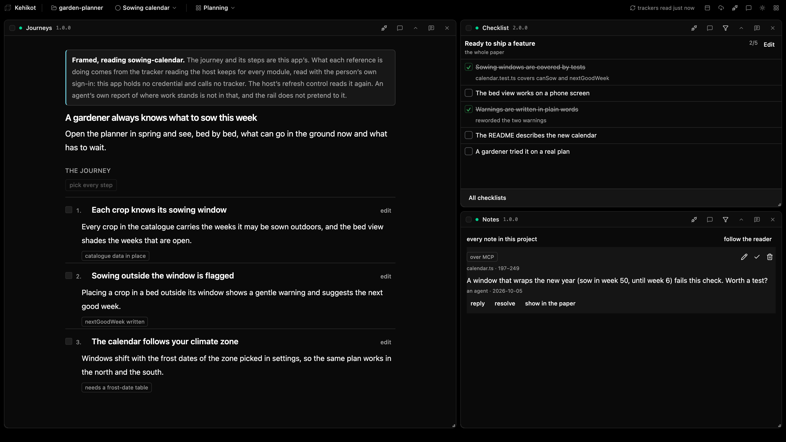

  

<h1 align="center">Kehikot for macOS</h1>

  <strong>One workbench for you and your coding agent: the same project, the same view.</strong>

  

---

When you work with a coding agent, the two of you are usually looking at
different things. You have the plan open, the agent has the code, and the
checklist lives somewhere neither of you can both see. Kehikot puts it all on
one canvas. You arrange small tools side by side, such as a checklist, notes, a
diff or a terminal, and your agent can read and use every one of them too.

  

## What you can do

- **Share one view with your agent.** Everything on your canvas is something
  your agent can read and work with, so you stop copying and pasting context.
- **Build a workspace for each task.** Keep one canvas for writing, one for
  review and one for code, and switch between them with a click.
- **Hold work to a checklist.** Your agent ticks items off and says how it
  knows, and you watch the progress as it happens.
- **Leave notes on the exact passage.** A note stays attached to the words it
  is about, so you and your agent talk about the same line.
- **Keep your work on your machine.** Everything runs locally, with no account.
  Your data stays in your project folder, as plain files.

## Install

1. Download the `.dmg` from the
   **[latest release](https://github.com/Jalez/kehikko-desktop/releases/latest)**.
2. Open it and drag **Kehikot** to your Applications folder.
3. Open Kehikot. From then on it keeps itself up to date.

If an older version won't open, allow it once in **System Settings → Privacy &
Security → Open Anyway**.

## Getting started

1. **Add a project.** Click the button at the end of the project list and pick
   a folder you work in.
2. **Add tools.** Each tool is a small program of its own: journeys, checklists,
   notes, a terminal, diffs, papers and more. Install the ones you want from the
   [list of tools](https://github.com/Jalez/kehikko#tools), then put them on
   your canvas with **+**.
3. **Connect your agent.** The plug icon in a tool's header connects it to your
   coding agent, so you are both looking at the same thing.
4. **Make more canvases** as your work needs them, one per kind of task.

---

  <a href="docs/README.md">Technical guide</a> ·
  <a href="https://github.com/Jalez/kehikko">The workbench (source)</a> ·
  <a href="https://github.com/Jalez/kehikko-protocol">Write your own tool</a>

<em>Kehikko</em> is Finnish for a frame. <em>Kehikot</em> are the frames.

